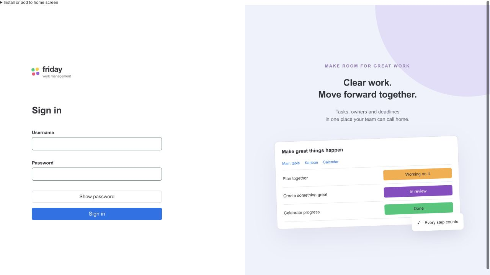
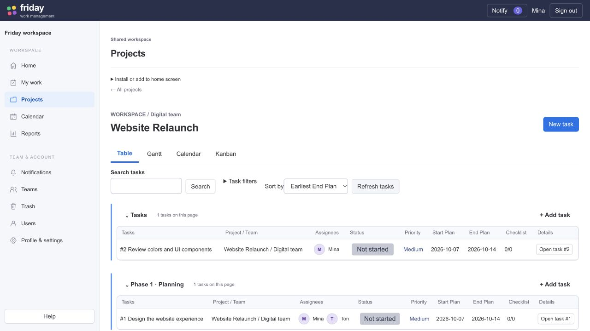
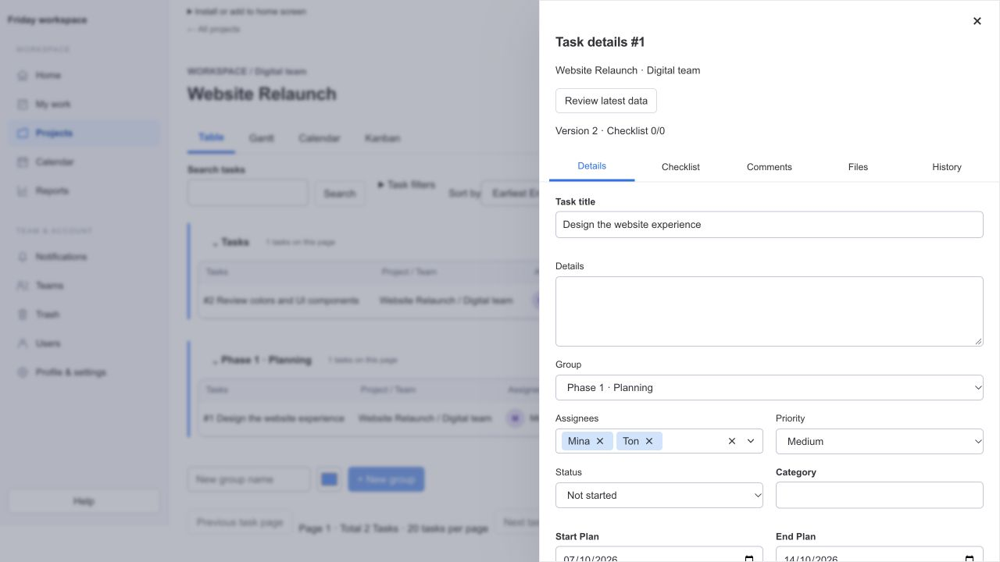
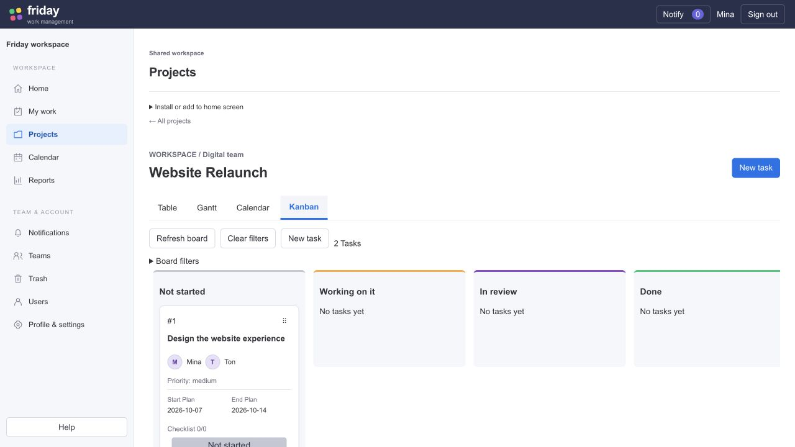

# Vibe applied to Friday Management — 7 October 2026

**Design fidelity follow-up:** The owner reported this first integration did not match the approved mock. See TeamFlow_UI_Vibe_Parity_Report.md for the corrected project/sidebar/table/drawer/Kanban structure and current evidence. The checks below describe the earlier functional integration.

นำแบบที่เจ้าของอนุมัติมาใช้กับแอปจริงแล้ว: Login/Setup/password flow, workspace shell, project/my-work views, task drawer และ collaboration panels ใช้ English base และ compact styling. ใช้ Monday Vibe4.5.34 จริงสำหรับ Button/Dropdown/Avatar และ tokens; sidebar แบ่ง Workspace/Team & Account พร้อมไอคอน/active state/mobile menu. Project board อยู่ในหน้า workspace จึงเข้าถึงเมนูซ้าย/Notify ได้; task details เปิดเป็น right drawer. ข้อมูลผู้ใช้รองรับ Unicode ตามเดิม.

Task บันทึกผู้รับผิดชอบหลายคน, Checklist เลือกผู้รับผิดชอบแยกกันได้, New Group มีชื่อ/สี/empty state/collapse และ Add task ภายในกลุ่ม. Group changes จากอีกหน้าต่างปรากฏตาม shared refresh ภายใน10วินาทีในการทดสอบ. Start Plan/End Plan แยกกัน. Status เป็น inline dropdown26px ไม่มีลูกศรแยกและจัดข้อความกลาง (ความคลาดเคลื่อน<1pxทั้งสองแกน). Kanban ลากจริงได้ พร้อม FLIP320msข้ามคอลัมน์/220msสำหรับการขยับเพื่อนบ้าน และ reduced motion. Avatar24px/initials10px สีอ่านชัด อยู่ติดชื่อ.

API1.2.0 มี56routes/81schemas; SQLite0003/0004 และ SQL Server0003/0004 แยกกัน. Assignment eligibility/withdrawal/audit/notification/recurrence/reopen/restore/retention/filter/workload/CSV/reminders รองรับ secondary owners และ independent checklist owners. Legacy assignee scalar เป็น compatibility alias ของ ID ต่ำสุด. การมอบหมายไม่เพิ่มสิทธิ์. TaskEvent cleanup ขนาดใหญ่รวม serialized changes เพื่อไม่เกิน100รายการและไม่ตัดประวัติ.

Vibe runtime style injection ถูกแปลงเป็น external CSS ระหว่าง Vite build จึงใช้งานภายใต้ CSPเดิมได้. ไม่มีการผ่อน script/style security policy. Source delivery นี้ไม่ได้ deploy และไม่ได้เปลี่ยน shared Node22 runtime.

| Verification | Actual result |
|---|---|
| Full npm regression | PASS466/466: Node428 + frontend38; failures0 |
| Final frontend follow-up | PASS38/38 after board/group refresh changes |
| Chromium Vibe integration | PASS2/2: real API persistence, remote Group refresh, multi-owners, Checklist owner, centered status, avatar color, CSP0errors, native drag/motion, mobile/reduced-motion |
| Typecheck / lint / build | PASS; build has existing >500kB chunk warning (main~512kB) |
| Contract / test-plan checks | PASS56routes/81schemas; plan inventory PASS (not formal execution evidence) |
| Contract / planning unit tests | PASS as part of full npm suite |
| License inventory | PASS629packages/0missing |
| Native SQL Server | NOT_RUN:185SKIP/0executed |
| Windows / human UAT / full TC-AT-RV | NOT_RUN |

Full regression ran before the final group-refresh presentation follow-up; frontend38, browser2, type/lint/build were rechecked afterward. Backend/contract/migrations were unchanged by that follow-up. Full legacy browser suite has not been rerun after English label changes; the new integration suite verifies the listed desktop/mobile flows only. Physical touch, screen-reader, complete vendor current+previous browser matrix, new-build performance/load and fresh immutable ZIP acceptance remain pending.

Earlier failures were corrected before final runs: schema table/FK inventory after migrations, route count53→56, legacy audit expectations, default scalar alias conflicting with multi-owner create, and frontend history decoder missing new fields. Native style injection initially failed under CSP; external extraction resolved it. Final successful evidence is copied to `reports/vibe-implementation/*.txt`; temporary diagnostic failures are not promoted to PASS.

Dependency audit remains OPEN: production dependency tree has62findings (56moderate/6high/0critical), including Vibe transitive tooling. A non-breaking audit fix was attempted; findings remain. The audit's proposed major downgrade of Vibe/postcss was not applied. This is a remaining dependency/security review item, not a clean audit or production release approval. See `reports/vibe-implementation/dependency-audit.json`; historical preview audit files describe a different dependency tree.

Machine results/traceability: [reports/UI-vibe-implementation-results.json](reports/UI-vibe-implementation-results.json). Source checksums: [reports/vibe-implementation/source-checksums.json](reports/vibe-implementation/source-checksums.json). Local evidence maps to TC025/027/028/029/031/033/035/036/046/060/061/063/073 without marking formal cases complete. Task Register: DONE6/77, IN_PROGRESS71, TODO0, remaining71. Next T006/T007 High native SQL2022; T076 Medium human UAT. Actual runtime model/effort NOT_VERIFIED; declared UI Medium and contract/schema/assignment/recurrence/motion High.

Temporary actual-app review: http://127.0.0.1:43193/projects — synthetic SQLite data outside the repository, owner can deploy source later. Existing candidate ZIPs predate this redesign and must be regenerated/revalidated for a future release.

