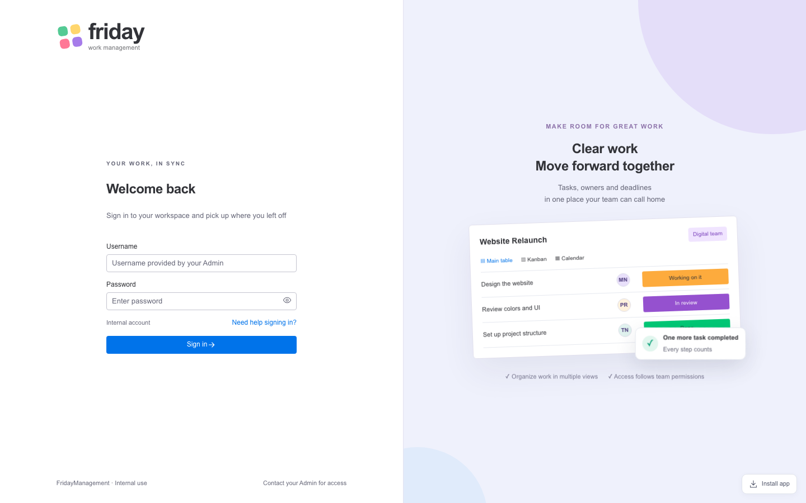
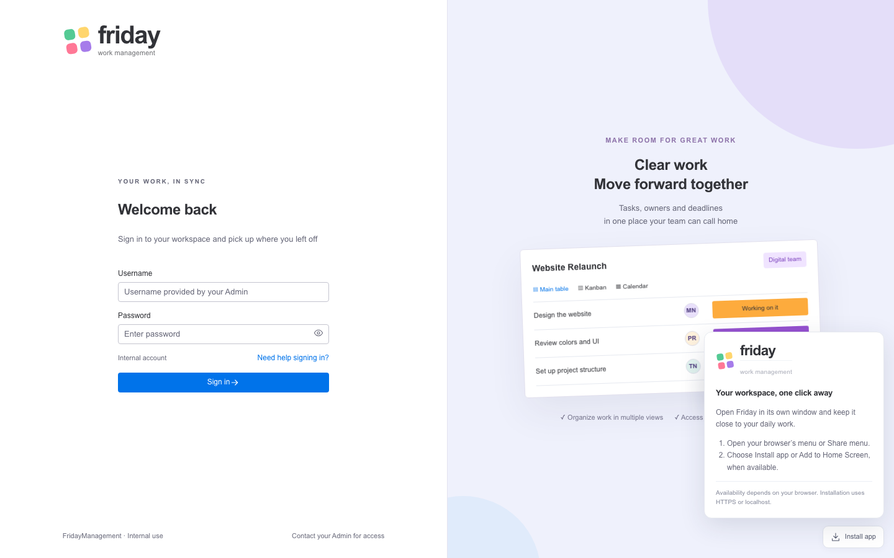
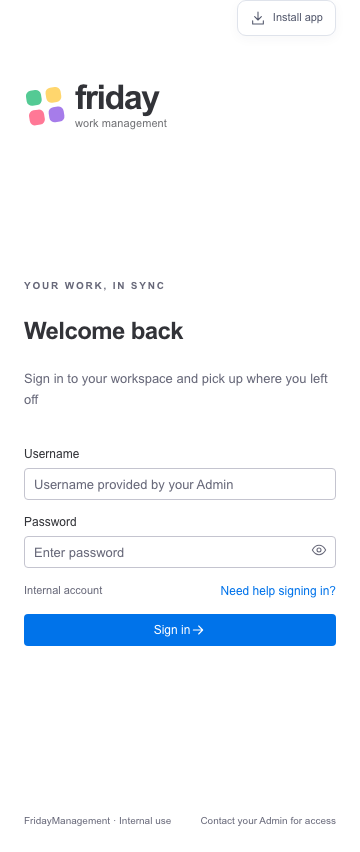

# Login / wordmark / install / motion follow-up — 7 October 2026

Owner reported Login still differed from the approved mock, requested a larger Friday logo, a polished install control, restored animations, and a password eye icon inside the textbox. Changed the actual Login structure: brand at top left; YOUR WORK, IN SYNC / Welcome back / intro;340px centered form in two equal desktop columns; English placeholders; eye toggle inside Password; internal-account/sign-in help row; compact full-width Vibe Sign in action; internal-use footer. Decorative Website Relaunch board matches the approved illustration: avatars, three vivid statuses, team label, floating completion card, lavender backdrop and two background orbs. Demo and setup bypass controls from the mock are not implemented in the authenticated application.

Native vector Friday mark is larger and sharper: Login wordmark40px/icon48px on desktop,34px/icon42px on mobile; workspace wordmark26px (20px on narrow screens). The Vibe mock was rebuilt with the same larger wordmark as explicitly requested by the owner. No image dependency or remote font/image service was added.

PWA summary is now an Install app button with download icon and an anchored card. Browsers that provide an installation prompt get an explicit Install Friday button; others show browser/Share menu guidance. Update ready uses a compact icon/card, retaining save-close-reopen semantics. Actual OS installation is NOT_RUN. There is no automatic install or forced worker replacement.

Restored form/copy/board/row/completion entrance animations; added brief route/project and generic dialog entrance transitions. Existing drawer and successful Kanban FLIP motion retained. OS reduced-motion gates CSS and route animation; no motion is required to use the app.

| Verification | Final result |
|---|---|
| Typecheck / lint / application build | PASS; lint0warnings; existing main bundle >500kB warning |
| Vibe mock build | PASS; no external runtime requests |
| Frontend unit suite | PASS38/38 before final logo-size cosmetic follow-up |
| Chromium Vibe suite | PASS4/4 after final application source changes |
| Final Login screenshots/checks | PASS1/1 after test capture follow-up |
| Login behavior | Eye click/keyboard/inside input, help Escape, invalid-login alert/password clearing, real valid login and logout |
| Layout |1440x900/720px columns/340px form/40px wordmark;360px no horizontal overflow |
| Motion | Normal artwork entrance and reduced-motion:none verified; existing native Kanban move suite passes |
| Native SQL/Windows/human UAT/full browser matrix/OS install | NOT_RUN |

One diagnostic Login selector omitted the accessible space at a line break; corrected and reran. Screenshot capture waits for entrance animation to finish; images use the real built frontend with an isolated synthetic API fixture and contain no entered credentials. Local user-facing app and approved mock both measured40px auth wordmark. No fake sign-in results, bypass account, default password, email reset or AI feature was added. Backend/schema/contracts unchanged.

Traceability: partial T014/TC003/TC004/TC006 Login/logout; T055 responsive/keyboard/reduced-motion; T056 installation guidance only. Formal TC/AT records remain unchanged. Evidence reports/UI-vibe-login-results.json and reports/vibe-login/*.txt. Existing dependency audit62 and bundle warning remain open. DONE6/77, IN_PROGRESS71, TODO0, remaining71. Declared UI Medium; actual runtime model/effort NOT_VERIFIED. Next owner visual/UAT review T055/T076 Medium; native SQL T006/T007 High.

