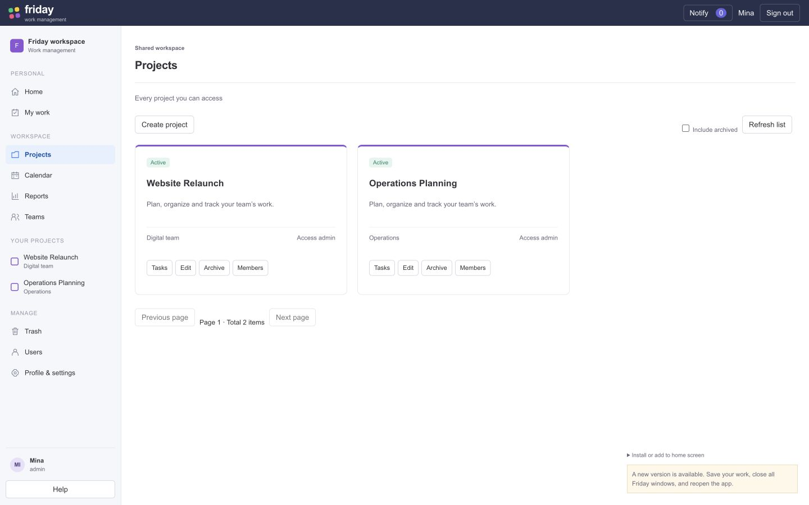
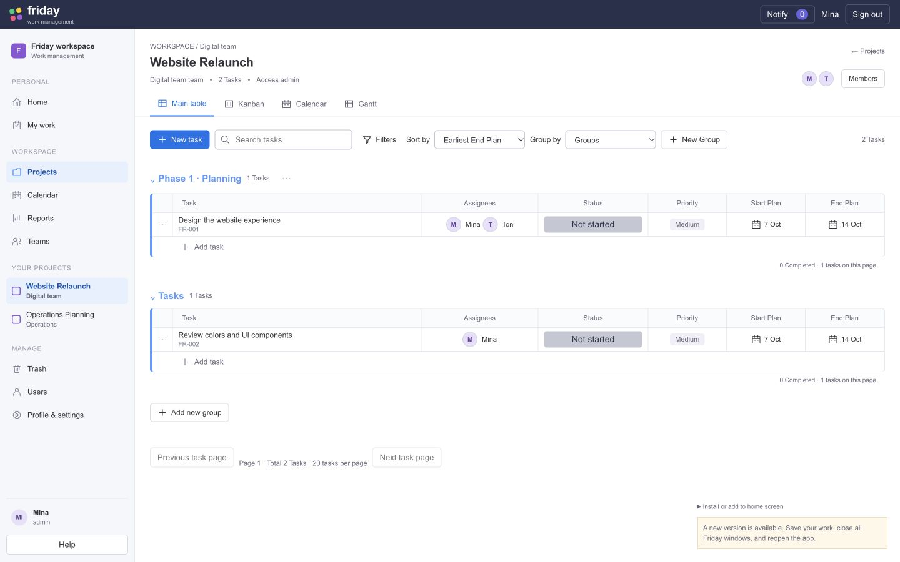
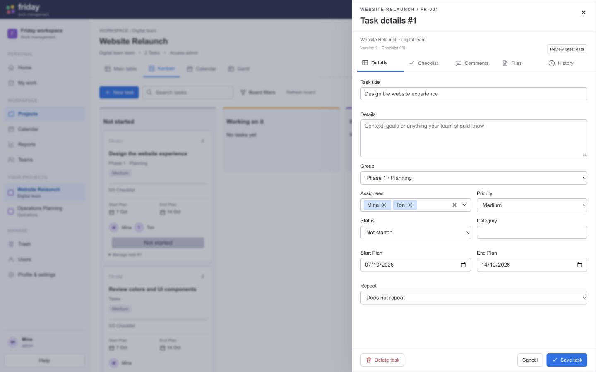
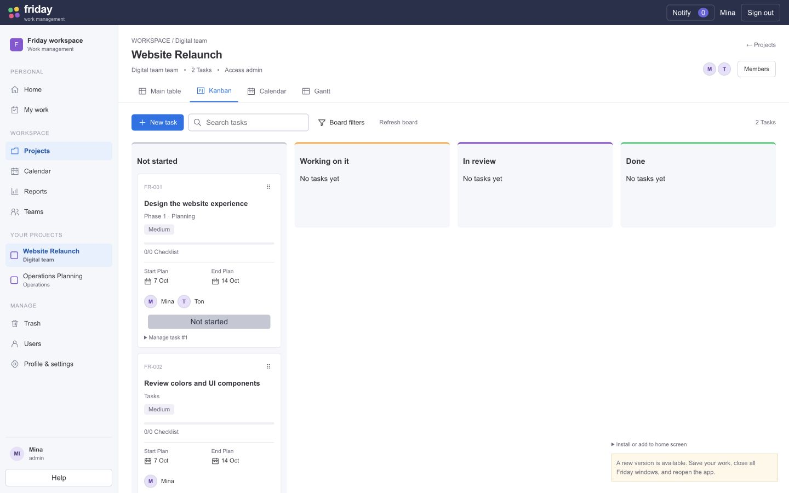

# Approved V06 design fidelity correction — 7 October 2026

The first production integration preserved too much of the old app structure. Functional integration evidence in TeamFlow_UI_Vibe_Implementation_Report.md does not establish fidelity to the approved mockup. This follow-up changes the actual React layout, using TeamFlow_UI_Vibe_Preview.html and design-preview/vibe styles as the reference.

Projects now uses a compact card directory, with actual project names/team/access and permission-checked management controls. Sidebar separates Personal, Workspace, Your projects and role-based Manage; project links open the board directly and survive reload. Returning to Projects removes the board. Project board has one visible heading, view icons, compact toolbar/search/popover filters, New task, sort, Group by and New Group. Group tables have seven columns, date icons/short English dates, title/FR-id, colored group headings, bottom Add task rows and completion summaries. Group names/colors can be edited through the existing versioned PATCH API. Status grouping does not mutate a task’s group or status.

Task details uses a 590px right drawer, icon tabs, compact form typography and a fixed footer. Footer submits the real form, preserving validation/offline/dirty/conflict/delete rules. Kanban shares the compact toolbar/card treatment, checklist progress, adjacent avatar/name, separate plans and four responsive lanes; existing drag/FLIP/reduced-motion behavior is retained. Board count stays available on Kanban. Members opens the actual scoped roster; no fake task counts, people, comments or API results were added. Auth styling in that correction retained the earlier implementation; the subsequent owner-requested Login/logo/install/motion correction is recorded in TeamFlow_UI_Vibe_Login_Report.md.

| Final verification | Result |
|---|---|
| Typecheck / lint / build | PASS; lint0warnings; existing main chunk >500kB warning |
| Frontend unit tests | PASS38/38 |
| Chromium integration | PASS3/3; final source build |
| API behavior | Multiple task owners, independent checklist owner, group create/edit/persistence, remote group refresh, fixed-footer task creation persisted |
| Geometry | sidebar216px, table7columns/38px rows, status26px centered within1px, drawer590px/footer at viewport bottom within border1px |
| Motion / security | Native drag and320ms FLIP; reduced-motion drawer; scoped console/CSP errors0 |
| Responsive | 360x800 menu/drawer/no document overflow and1440x900 desktop checks |
| Native SQL / Windows / human UAT | NOT_RUN |

Manual visual comparison used the same desktop viewport for the approved mock and actual app. Data/roles differ: mock Editor/10tasks versus real synthetic Admin/2tasks. Actual app retains admin controls, pagination and version/conflict safeguards. This is not a claim of pixel identity or completed owner UAT. Full legacy browser matrix, native SQL Server and performance/release checks were not rerun for this frontend correction. API schemas/backend/migrations unchanged.

Diagnostic runs found a case-sensitive New Group selector and assertions expecting a create drawer to remain open, plus a one-pixel dialog border. They were corrected to assert actual UI behavior and persisted records. A sandbox instance-guard restriction was resolved by running the localhost browser test with approved execution permission. Final logs only are in reports/vibe-parity. Earlier integration regression466/466 is historical; this correction reran frontend38 and browser3, not that entire suite.

Existing dependency audit62 findings and bundle-size warning remain open; source delivery is not a deployment. Task Register DONE6/77, IN_PROGRESS71, TODO0, remaining71. Declared UI effort Medium; actual runtime model/effort NOT_VERIFIED. Next owner visual/UAT review T-055/T-076 Medium; native SQL validation T-006/T-007 High.

Evidence: reports/UI-vibe-parity-results.json; reports/vibe-parity/*.txt; reports/vibe-parity/source-checksums.json.

